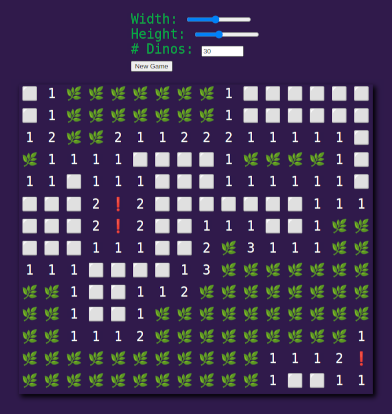

# dinomite
A Minesweeper Clone

Play it here: https://gglyptodon.github.io/dinomite/

Goal: uncover all the tiles with no hiding dinos
- left-click on a tile to see the number of dinos in the adjacent tiles
- tiles with zero neighboring dinos show up as white squares
- if you click on a dino, you lose
- right-click on a tile to place a marker
- middle-click on a tile with a number N and N neighboring markers to uncover its remaining adjacent tiles

## Build and Run
- ``cargo install wasm-pack``
- ``wasm-pack build --target web -d wasm``
- ``python3 -m http.server --bind localhost``
- Then go to http://127.0.0.1:8000/ 

### Alternatively build and run with docker
- ``docker build --rm -t dinomite .``
- ``docker run -p 8000:7000 -t dinomite``
- Then go to http://127.0.0.1:8000/
 

---
Credits:
*Heavily influenced* by yishn's cool [Let's Code with Rust and wasm](https://www.youtube.com/playlist?list=PLtTT8p-gjGEdGzZ0ET2bwNnA6iP_mmmrv)
